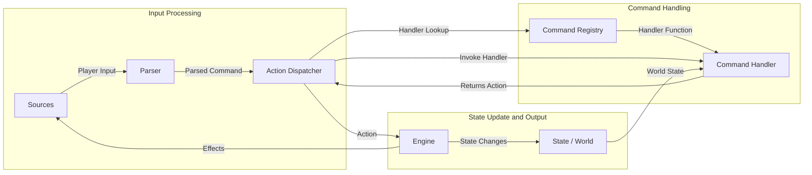

# Command Registry System

This document outlines the proposed Command Registry system for Gnusto, designed to provide a flexible, extensible, and maintainable way to handle player commands.

## Motivation

The previous approach of handling all command logic within a single `CommandParser` or `ActionDispatcher` using large conditional blocks (like `switch` statements) becomes difficult to manage and extend as the number of commands grows. It tightly couples command parsing, logic execution, and game-specific overrides.

The Command Registry system aims to:

1.  **Decouple** command identification from command execution logic.
2.  Make command handlers **first-class citizens**, allowing games to easily define, replace, or modify command behavior.
3.  Improve **maintainability** by isolating command logic into smaller, focused units.
4.  Enhance **extensibility**, simplifying the addition of new commands or game-specific variations.

## Architecture

The core idea is to introduce a `CommandRegistry` that maps command verbs (identified by the `Nitfol` parser) to specific handler functions. The `ActionDispatcher` uses this registry to route parsed commands to the correct logic.

### Data Flow Diagram

### Components

1.  **Parser (`Nitfol`)**: Takes raw player input and produces a structured `ParsedCommand` (containing verb, direct object, indirect object, prepositions, etc.).
2.  **Action Dispatcher**:
    - Receives the `ParsedCommand`.
    - Extracts the primary `verb`.
    - Queries the `CommandRegistry` using the `verb` to get the appropriate handler function.
    - Invokes the handler function, passing the full `ParsedCommand` and the current `World` state.
    - Receives the resulting `Action`(s) from the handler.
    - Passes the `Action`
