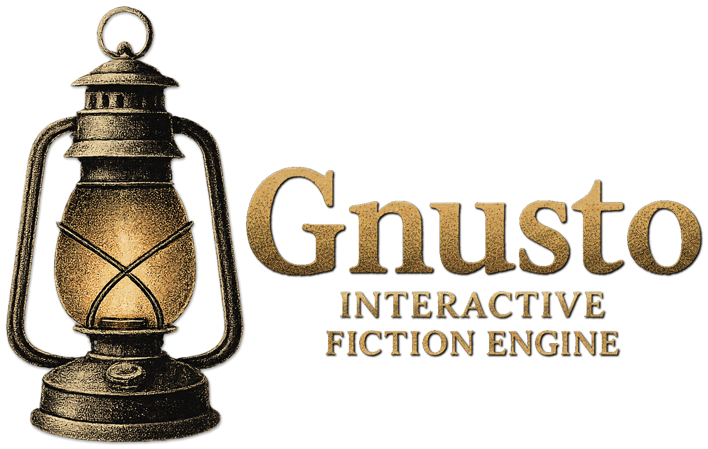

# Gnusto: A Modern Interactive Fiction Engine

Gnusto is a flexible and powerful framework for writing interactive fiction games. Drawing inspiration from the Infocom classics of the 1980s, it provides a modern toolkit that makes building rich, dynamic text adventures easy and enjoyable -- allowing you to focus on storytelling and world-building rather than engine mechanics.

Gnusto is written in cross-platform Swift, allowing you to deploy your games on Mac, Linux, Windows, iOS and Android. The framework emphasizes ergonomics and developer experience, providing type safety without boilerplate code. Built with extensibility in mind, you can customize and extend Gnusto to fit your creative vision.

At its core, Gnusto uses a state change pipeline that ensures safe state management, eliminating many of the bugs that can plague interactive fiction engines. Whether you're creating your first text adventure or building a complex, multi-layered world, Gnusto provides the foundation you need while staying out of your way.

## For Game Creators

### Key Features

- **Cross-Platform Ready:** Deploy your game on macOS, iOS, Linux, Windows, and Android
- **Automatic Setup:** The GnustoAutoWiringPlugin discovers your game patterns and generates all necessary boilerplate code
- **Dynamic Content:** Create living, breathing worlds with state-driven descriptions and behaviors
- **Rich Action System:** Support complex player interactions with a flexible action pipeline that's easy to customize
- **Smart Parser:** Natural language understanding with support for complex commands, synonyms, adjectives, and object references
- **Combat & Character Systems:** Full RPG-style mechanics with character sheets, health tracking, and combat management
- **Conversations & NPCs:** Built-in dialogue systems and character interactions
- **Localization Ready:** Centralized messaging system enables easy customization of all player-facing text
- **Extensible Architecture:** Add custom behaviors and game mechanics without fighting the engine

### Quick Start

1. **Add Gnusto to Your Project:**

   ```swift
   // Package.swift
   dependencies: [
       .package(url: "https://github.com/samadhiBot/Gnusto", from: "0.1.0"),
   ],
   targets: [
       .executableTarget(
           name: "MyGame",
           dependencies: ["GnustoEngine"],
           plugins: ["GnustoAutoWiringPlugin"]  // ← This eliminates all boilerplate!
       ),
   ]
   ```

2. **Define Your World:** Create locations and items organized into logical areas
3. **Add Dynamic Behavior:** Write event handlers for custom interactions
4. **Create Your GameBlueprint:** The plugin handles all the wiring automatically
5. **Run Your Game:** Deploy to any supported platform

### Example Code

Here's how simple it is to create an interactive world with Gnusto:

```swift
import GnustoEngine

struct OperaHouse {  // Organize content into logical areas
    let foyer = Location(.foyer)  // Plugin auto-generates LocationID.foyer
        .name("Foyer of the Opera House")
        .description(
            """
            You are standing in a spacious hall, splendidly decorated in red
            and gold, with glittering chandeliers overhead. The entrance from
            the street is to the north, and there are doorways south and west.
            """
        )
        .south(.bar),
        .west(.cloakroom)
        .north(
            """
            You've only just arrived, and besides, the weather outside
            seems to be getting worse.
            """
        )
        .inherentlyLit

    let cloak = Item(.cloak)  // Plugin auto-generates ItemID.cloak
        .name("velvet cloak")
        .description(
            """
            A handsome cloak, of velvet trimmed with satin, and slightly
            spattered with raindrops. Its blackness is so deep that it
            almost seems to suck light from the room.
            """
        )
        .adjectives("handsome", "dark", "black", "velvet", "satin")
        .in(.player)
        .isTakable
        .isWearable
        .isWorn

    // Custom behavior for examining items
    let hookHandler = ItemEventHandler(for: .hook) {
        before(.examine) { context, command in
            let hookDetail =
                if await context.item.isHolding(.cloak) {
                    "with a cloak hanging on it"
                } else {
                    "screwed to the wall"
                }
            return ActionResult("It's just a small brass hook, \(hookDetail).")
        }
    }
}
```

For a complete working example, see the [Cloak of Darkness](Executables/CloakOfDarkness/) implementation that demonstrates these concepts in a playable game.

The `GnustoAutoWiringPlugin` automatically handles the tedious parts of game setup -- it scans your code for game content patterns, generates ID constants, aggregates content from multiple files, and wires up event handlers. This lets you focus on creating your game world rather than managing boilerplate code to wire everything together.

## Example Games

### Cloak of Darkness

A faithful recreation of Roger Firth's standard interactive fiction demo, showcasing:

- Three-room layout with dynamic connections
- Light/dark mechanics affecting game state
- Object interaction and state tracking
- Dynamic descriptions based on player actions
- Score tracking and win conditions

### Frobozz Magic Demo Kit (In Progress)

A demonstration game that will feature:

- Advanced pattern examples
- Custom action handler implementations
- Complex state management scenarios
- Time-based event demonstrations
- Multi-area game organization

### Zork 1 (In Progress)

A faithful recreation of the original Zork I, featuring:

- Complete world implementation with 15+ detailed areas (Forest, Underground, Dam, etc.)
- Authentic messaging and interactions based on the original ZIL implementation
- Complex puzzles and treasure hunting mechanics
- Full reference implementation of classic IF patterns

## Contributing

We'd love to have you contribute to Gnusto! Whether you're interested in creating games with the engine or helping improve the engine itself, you're welcome here.

If you're a game developer, we invite you to take Gnusto for a spin and see how it feels. Try building something small first, then let us know about any rough edges you encounter. We welcome bug reports, feature requests, documentation improvements, and any other contributions that help make interactive fiction development more accessible.

For engine developers, we follow modern Swift development practices with comprehensive testing and clear documentation. Check out our development standards in the project documentation, and feel free to jump in with fixes, new features, or improvements to existing systems.

## What's Next?

Ongoing development priorities:

1. **Improving documentation:** More how-to articles and guides covering combat systems, character development, and messaging
2. **Completing Zork 1 implementation:** Finishing the full Zork I recreation as a flagship demonstration
3. **Improved conversation management:** Better tools for building dialogue systems and NPC interactions
4. **Refine and balance melee combat:** The melee combat system is functional but still needs polish
5. **Enhanced character sheet integration:** Making better use of character attributes throughout the engine
6. **Enhanced platform integration:** Improved I/O wrappers and user interface components for different deployment targets
7. **Expanded combat systems:** Adding ranged and magical combat to complement the existing melee system

---

## License

MIT License

Copyright (c) 2025 Chris Sessions

Permission is hereby granted, free of charge, to any person obtaining a copy
of this software and associated documentation files (the "Software"), to deal
in the Software without restriction, including without limitation the rights
to use, copy, modify, merge, publish, distribute, sublicense, and/or sell
copies of the Software, and to permit persons to whom the Software is
furnished to do so, subject to the following conditions:

The above copyright notice and this permission notice shall be included in all
copies or substantial portions of the Software.

THE SOFTWARE IS PROVIDED "AS IS", WITHOUT WARRANTY OF ANY KIND, EXPRESS OR
IMPLIED, INCLUDING BUT NOT LIMITED TO THE WARRANTIES OF MERCHANTABILITY,
FITNESS FOR A PARTICULAR PURPOSE AND NONINFRINGEMENT. IN NO EVENT SHALL THE
AUTHORS OR COPYRIGHT HOLDERS BE LIABLE FOR ANY CLAIM, DAMAGES OR OTHER
LIABILITY, WHETHER IN AN ACTION OF CONTRACT, TORT OR OTHERWISE, ARISING FROM,
OUT OF OR IN CONNECTION WITH THE SOFTWARE OR THE USE OR OTHER DEALINGS IN THE
SOFTWARE.
