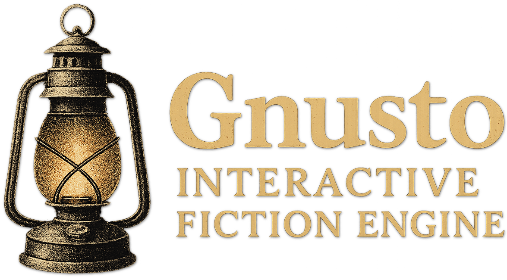

A modern Swift implementation of an Interactive Fiction (IF) engine, designed to be powerful, flexible, and maintainable. The engine is built with a focus on clean, efficient, and well-structured code, adhering to SOLID principles and modern Swift practices.

## Project Structure

The project is organized into two main directories:

- **Sources/GnustoEngine:** Contains the core engine code.
- **Executables:** Contains example games and demos built using the engine.

## Core Concepts

### Game World Model

- **Entities:** The game world is defined by `Location` and `Item` objects, each with:

  - Static definition data (ID, name, vocabulary words)
  - Dynamic state via `[AttributeID: StateValue]` dictionary (`attributes`)
  - Optional description handlers for dynamic text generation
  - Optional action handlers to override default behavior

- **State Management:**

  - Centralized in `GameState`, mutated via `StateChange` objects
  - All state changes are tracked and validated
  - Supports custom state on items and locations
  - Handles fuses (timed events) and daemons (background processes)

- **Action System:**
  - Player input parsed into `Command` objects
  - `ActionHandler`s process commands via a pipeline:
    1. `validate`: Check if action can be performed
    2. `process`: Execute the action and return results
    3. `postProcess`: Handle side effects
  - Returns `ActionResult` with success status, message, and state changes

### Core Features

#### Item System

The `Item` class represents interactable objects with:

- **Properties:** Configurable via `ItemProperty` values
- **Descriptions:** Support for static and dynamic text
- **Vocabulary:** Synonyms and adjectives for flexible parsing
- **Inventory:** Size and capacity management
- **State:** Custom attributes and flags

#### Location System

The `Location` class defines game areas with:

- **Exits:** Connections to other locations
- **Contents:** Items present in the location
- **State:** Custom attributes and flags
- **Action Handlers:** Location-specific behavior

#### Parser

The `StandardParser` implements a ZIL-inspired command parser:

- **Tokenization:** Splits input into significant words
- **Verb Matching:** Supports multi-word verbs and synonyms
- **Object Resolution:** Handles pronouns, adjectives, and scope
- **Grammar Rules:** Configurable syntax patterns
- **Error Handling:** Detailed parsing error messages

## Development Standards

### Code Organization

- **Logical Grouping:** Properties, initializers, computed properties, public functions, private functions
- **Alphabetization:** Within logical groups, unless a different order is more natural
- **File Structure:** One type per file, with nested types kept in parent file unless large/complex
- **Documentation:** Clear `///` documentation for public APIs, minimal `//` comments for non-obvious code

### Testing

- **Framework:** `Swift Testing` for new code
- **Coverage:** 80-90% test coverage in pull requests
- **Organization:** Tests mirror source structure
- **Documentation:** Test cases clearly describe behavior

### Documentation

- **API Documentation:** `///` comments for all public types, functions, properties
- **Design Documents:** Markdown files in `Docs/` directory
- **Examples:** Example games demonstrating engine features
- **References:** Historical IF source code for research

## Example Games

### Cloak of Darkness

A simple demonstration of Interactive Fiction, showcasing the engine's capabilities:

- Three rooms: Foyer, Bar, and Cloakroom
- Three objects: Hook, Cloak, and Message
- Dynamic descriptions and action handling
- Light/dark mechanics
- Score tracking

### Frobozz Magic Demo Kit

A comprehensive demo kit providing:

- Template for new games
- Example implementations of common IF patterns
- Documentation of engine features
- Best practices for game development

## Getting Started

1. Clone the repository
2. Open the project in Xcode
3. Build and run the example games in `Executables/`

### Reference Materials

The project includes historical IF source code for research:

```bash
./Scripts/fetch_infocom_sources.sh
```

This script fetches:

- "A Mind Forever Voyaging"
- "Hitchhikers Guide to the Galaxy"
- "Zork 1"

Note: Reference materials (except "Cloak of Darkness") are not tracked in git.

## Contributing

Contributions are welcome! Please:

1. Follow the development standards
2. Include appropriate tests
3. Document your changes
4. Reference the [ROADMAP.md](Docs/ROADMAP.md) for planned features

## License

MIT License

Copyright (c) 2025 Chris Sessions

Permission is hereby granted, free of charge, to any person obtaining a copy
of this software and associated documentation files (the "Software"), to deal
in the Software without restriction, including without limitation the rights
to use, copy, modify, merge, publish, distribute, sublicense, and/or sell
copies of the Software, and to permit persons to whom the Software is
furnished to do so, subject to the following conditions:

The above copyright notice and this permission notice shall be included in all
copies or substantial portions of the Software.

THE SOFTWARE IS PROVIDED "AS IS", WITHOUT WARRANTY OF ANY KIND, EXPRESS OR
IMPLIED, INCLUDING BUT NOT LIMITED TO THE WARRANTIES OF MERCHANTABILITY,
FITNESS FOR A PARTICULAR PURPOSE AND NONINFRINGEMENT. IN NO EVENT SHALL THE
AUTHORS OR COPYRIGHT HOLDERS BE LIABLE FOR ANY CLAIM, DAMAGES OR OTHER
LIABILITY, WHETHER IN AN ACTION OF CONTRACT, TORT OR OTHERWISE, ARISING FROM,
OUT OF OR IN CONNECTION WITH THE SOFTWARE OR THE USE OR OTHER DEALINGS IN THE
SOFTWARE.
