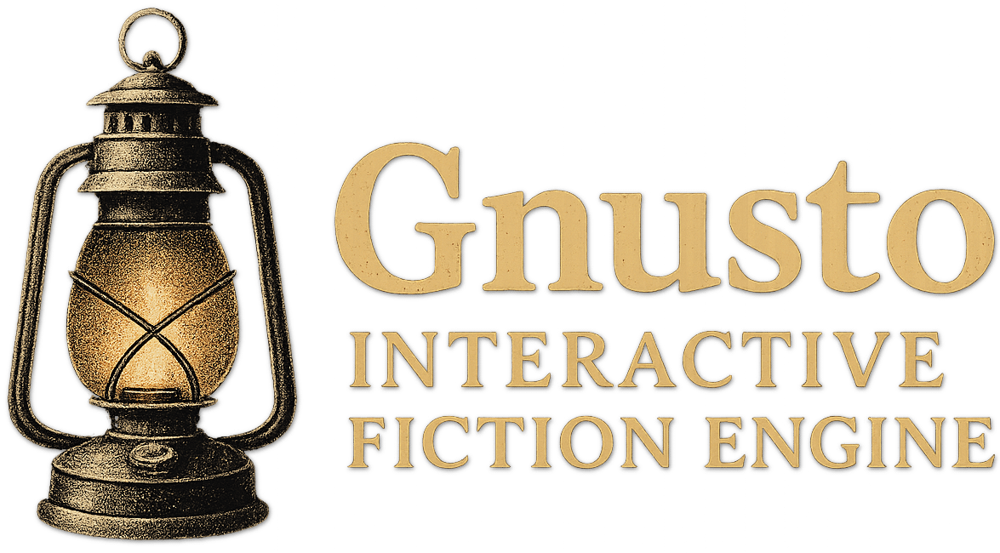

# Gnusto: A Modern Interactive Fiction Engine

Gnusto is a flexible and powerful framework for writing [interactive fiction](https://www.perplexity.ai/search/what-is-interactive-fiction-pl-1uYPS4fUSfqGegXJHr1tRA#0) games. Drawing inspiration from the Infocom classics of the 1980s, it provides a modern toolkit that makes building rich, dynamic text adventures easy and enjoyable--allowing you to focus on storytelling and world-building rather than engine mechanics.

- Gnusto is written in cross-platform Swift, allowing you to deploy your games on Mac, Linux, Windows, iOS, Android and Web.
- The framework emphasizes ergonomics and developer experience, providing type safety without boilerplate code.
- Built with extensibility in mind, you can customize and extend Gnusto to fit your creative vision.

At its core, Gnusto uses a state change pipeline that ensures safe state management, eliminating many of the bugs that can plague interactive fiction engines. Whether you're creating your first text adventure or building a complex, multi-layered world, Gnusto provides the foundation you need, while staying out of your way.

## Building Your First Game

Creating a game with Gnusto begins with three main concepts: locations, items, and events. In each case, Gnusto provides a declarative syntax for defining your world. Simply declare a location or item, and begin adding the details you care about, in any order you like.

### Locations: Places in Your World

A ``Location`` represents any place the player can visit -- a room, forest clearing, or spaceship bridge. Here's a simple example:

```swift
let westOfHouse = Location(.westOfHouse)
    .name("West of House")
    .description(
        """
        You are standing in an open field west of a white house,
        with a boarded front door.
        """
    )
    .north(.northOfHouse)
    .south(.southOfHouse)
    .east(blocked: "The door is boarded and you can't remove the boards.")
    .inherentlyLit
```

The first line declares the location and its unique identifier: `.westOfHouse`. The next lines give it a player-facing name and description, followed by the places you can go from here -- or specifically cannot go, in the case of walking east. The final line gives the location light, so you don't need a lantern to see here.

### Items: Objects and Characters

An ``Item`` can be anything the player interacts with -- objects, characters, even abstract concepts:

```swift
let cloak = Item(.cloak)
    .name("velvet cloak")
    .description(
        """
        A handsome cloak, of velvet trimmed with satin, and slightly
        spattered with raindrops. Its blackness is so deep that it
        almost seems to suck light from the room.
        """
    )
    .adjectives("handsome", "dark", "black", "velvet", "satin")
    .in(.player)
    .isTakable
    .isWearable
    .isWorn
```

The first line declares the item and its unique identifier: `.cloak`, and the next lines give it a name and description. Next are adjectives used to describe the item, so that the engine will understand commands like `LOOK AT MY HANDSOME BLACK CLOAK`. The next line places the item in the player's possession, and the final lines specify that the item can be taken and worn, and that indeed the player is currently wearing it.

### Events: Responding to Player Commands

``LocationEvent`` and ``ItemEvent`` are event handlers that let you customize how your game responds when the player interacts with specific locations or items. You can intercept actions before they happen, to override default behavior, or after they complete, to add side effects or additional narrative.

The first example watches for interactions that take place in the `.trollRoom`. In this location there is a troll who prevents the player from going through the room's east and west exists. The player must either go back south to the cellar, or find some way to outwit the nasty troll.

```swift
let trollRoomHandler = LocationEventHandler(for: .trollRoom) {
    beforeTurn(.move) { context, command in
        if let direction = command.direction, [.east, .west].contains(direction) {
            throw ActionResponse.feedback(
                "The troll fends you off with a menacing gesture."
            )
        }
    }
}
```

The next example watches for interactions with the `.cloak` item, and prevents the player from putting it down unless they're standing in the Cloak Room.

```swift
let cloakHandler = ItemEventHandler(for: .cloak) {
    before(.drop, .insert) { context, _ in
        guard await context.player.location == .cloakroom else {
            throw ActionResponse.feedback(
                "This isn't the best place to leave a smart cloak lying around."
            )
        }
    }
}
```

In addition to providing player-facing messages, event handlers can also trigger changes to the state of the game.

## Gnusto's Key Features

- **Declarative Syntax**: Define your world with fluent, chainable builders that let you focus on what matters—your game's story and mechanics
- **Type Safety**: Strongly-typed IDs and Swift 6 strict concurrency prevent common bugs at compile time
- **State Change Pipeline**: All mutations flow through a safe, structured pipeline that eliminates state management bugs
- **Natural Language Parser**: Handles synonyms, adjectives, pronouns, multiple objects, and complex commands like "put the brass lamp in the trophy case"
- **Rich Interactions**: More than 80 built-in action handlers covering everything from "take" and "examine" to "attack" and "tell"
- **Event System**: Intercept and modify behaviors with before/after hooks on items and locations
- **Time-Based Mechanics**: Daemons and fuses enable autonomous behaviors and timed events independent of player actions
- **Combat & RPG Systems**: D&D-style d20 combat with character sheets, attributes, and enemy AI
- **Extensible Architecture**: Add custom action handlers, messengers, property computers, and combat systems without fighting the framework
- **Cross-Platform**: Develop on Mac, Linux or Windows; deploy on Mac, iOS, Linux, Windows, Android and WebAssembly
- **Automatic Setup**: The `GnustoAutoWiringPlugin` discovers your content and generates all ID constants and wiring code
- **Test-Driven**: Built for testability with Swift Testing integration and 80-90% coverage standards

## Getting Started

If you already have Swift 6.2+ installed on your machine, getting started with Gnusto is only a command away.

```bash
# Verify that Swift 6.2+ is available
swift -v
```

If you need to install Swift 6.2 locally, follow the instructions at [swift.org](https://www.swift.org/install/), and then continue with the steps below.

### Option 1: Automatic

The easiest way to get started is by running Gnusto's [bootstrap](https://github.com/samadhiBot/Gnusto/blob/main/Scripts/bootstrap) script. It sets up a new game scaffold on your own machine.

```bash
# Run the bootstrap script from Github:
bash <(curl -sSL https://raw.githubusercontent.com/samadhiBot/Gnusto/refs/heads/main/Scripts/bootstrap)

# Or, clone the repo and run the bootstrap script locally:
git clone https://github.com/samadhiBot/Gnusto.git
./Gnusto/Scripts/bootstrap
```

[](https://asciinema.org/a/746386)

### Option 2: Manual

If you'd rather put things together manually, setting up Gnusto is still easy. Follow these steps to get started:

1. **Add Gnusto to your Swift package** and include the ``GnustoAutoWiringPlugin``
    ```swift
    // Package.swift
    dependencies: [
        .package(url: "https://github.com/samadhiBot/Gnusto", from: "0.2.0"),
    ],
    targets: [
        .executableTarget(
            name: "MyGame",
            dependencies: ["GnustoEngine"],
            plugins: ["GnustoAutoWiringPlugin"]
        ),
    ]
    ```
2. **Organize your content** into logical groups that make sense to you
    ```
    CloakOfDarkness/                  Zork1/
    ├── CloakOfDarkness.swift         ├── main.swift
    ├── main.swift                    ├── World
    └── OperaHouse.swift              │   ├── Forest.swift
                                      │   ├── OutsideHouse.swift
                                      │   ├── ...
                                      │   ├── Thief.swift
                                      │   ├── Troll.swift
                                      │   └── Underground.swift
                                      ├── Zork1.swift
                                      └── ZorkMessenger.swift
    ```
3. **Define your world** with ``Location`` and ``Item`` objects
    ```swift
    struct OperaHouse {
        let cloakroom = Location(.cloakroom)
            .name("Cloakroom")
            .description(
                """
                The walls of this small room were clearly once lined with hooks,
                though now only one remains. The exit is a door to the east.
                """
            )
            .east(.foyer)
            .inherentlyLit

        let hook = Item(.hook)
            .adjectives("small", "brass")
            .in(.cloakroom)
            .omitDescription
            .isSurface
            .name("small brass hook")
            .synonyms("peg")
    }
    ```
4. **Add dynamic behavior** using ``ItemEventHandler`` and ``LocationEventHandler``, ``Daemon`` and ``Fuse``
    ```swift
    extension Troll {
        static let trollHandler = ItemEventHandler(for: .troll) {
            before(.tell) { context, command in
                ActionResult("The troll isn't much of a conversationalist.")
            }
        }
    }
    ```
5. **Customize default responses** by overriding standard messaging
    ```swift
    class ZorkMessenger: StandardMessenger {
        override func roomIsDark() -> String {
            output("It is pitch black. You are likely to be eaten by a grue.")
        }
    }
    ```
6. **Create a** ``GameBlueprint`` to bring everything together
    ```swift
    struct CloakOfDarkness: GameBlueprint {
        let title = "Cloak of Darkness"
        let abbreviatedTitle = "Cloak"
        let introduction = """
            A basic IF demonstration.

            Hurrying through the rainswept November night, you're glad to see the
            bright lights of the Opera House. It's surprising that there aren't more
            people about but, hey, what do you expect in a cheap demo game...?
            """
        let release = "0.0.3"
        let maximumScore = 2
        let player = Player(in: .foyer)
    }
    ```
7. **Run your game** with ``GameEngine``
    ```swift
    import GnustoEngine

    let engine = await GameEngine(
        blueprint: CloakOfDarkness(),
        parser: StandardParser(),
        ioHandler: ConsoleIOHandler()
    )

    await engine.run()
    ```

## Learning by Example

The quickest way to understand Gnusto is by looking at working examples:

- [Cloak of Darkness](https://github.com/samadhiBot/Gnusto/tree/main/Executables/CloakOfDarkness)
    A minimalist interactive fiction game created by Roger Firth in 1999. It is regarded as the "Hello, world!" of interactive fiction, and is used as a reference implementation to compare features and capabilities across IF systems.

- [Zork 1: The Great Underground Empire](https://github.com/samadhiBot/Gnusto/tree/main/Executables/Zork1)
    A pioneering text adventure game released by Infocom in 1980, based on the original MIT mainframe game developed in the late 1970s. It is widely recognized as one of the most influential works of interactive fiction, notable for its sophisticated parser, rich puzzles, and imaginative setting. This comprehensive recreation is still in progress, but already features combat, characters, and complex interactions.

Start with _Cloak of Darkness_ to see how a whole game fits together, then explore _Zork_ to study the more advanced patterns.

## How to Run the Example Games

To run the example games in a terminal, first clone the Gnusto repository and `cd` into the project folder, then `swift run` either `CloakOfDarkness` or `Zork1`.

```zsh
git clone https://github.com/samadhiBot/Gnusto.git
cd Gnusto

# Run Cloak of Darkness
swift run CloakOfDarkness

# Run Zork
swift run Zork1
```

Xcode users can select `CloakOfDarkness` or `Zork1` as the active scheme, Run the scheme, and play the game in the Xcode console.

For VS Code users, the Debug Console does not support interactive keyboard input, and the Swift debug adapter does not support rerouting to a different terminal. For now, the best option is to run the commands above in the integrated terminal.

[](https://asciinema.org/a/743893)

## Where to Go from Here

Now that you understand the basics of Gnusto, here are some resources to help you dive deeper:

### Game Structure and Dynamic Behavior

Learn how to organize your game world effectively and bring it to life with dynamic proxies, event handlers, and time-based behaviors. This guide covers the architecture that powers sophisticated interactive fiction.

**Read more**: [Game Structure and Dynamic Behavior](https://samadhibot.github.io/Gnusto/documentation/gnustoengine/gamestructure)

### Frequently Asked Questions

Quick answers to common questions about platforms, tooling, development workflow, and how Gnusto compares to other IF systems.

**Read more**: [Frequently Asked Questions](https://samadhibot.github.io/Gnusto/documentation/gnustoengine/faqs)

### Contributing to Gnusto

We'd love to have you contribute to Gnusto! Whether you're interested in creating games with the engine or helping improve the engine itself, you're welcome here.

If you're a **game developer**, we invite you to take Gnusto for a spin and see how it feels. Try building something small first, then let us know about any rough edges you encounter. We welcome bug reports, feature requests, documentation improvements, and any other contributions that help make interactive fiction development more accessible.

For **engine developers**, we follow modern Swift development practices with comprehensive testing and clear documentation. Check out our development standards and feel free to jump in with fixes, new features, or improvements to existing systems.

**Read more**: [Contributing to Gnusto](https://github.com/samadhiBot/Gnusto/blob/main/CONTRIBUTING.md)
